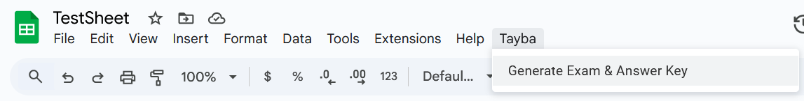

# Exam Generator Script
## Description
This script uses Google's AppScript functionality to transform a Google sheet into a properly formatted and randomized 
student exam. It reads all questions in the format prompt/answer/choice1/choice2/etc. It starts reading at column B, 
row 8, turning each row into a question object which will then be written into the output google doc.

## Features
- Randomizes the order of questions
- Randomizes the order of choices for each question
- Formats the output in a clear and organized manner
- Outputs the exam and answer key to new Google Docs
- Supports multiple choice questions with any number of choices

## Requirements
- A Google Sheet with questions formatted as follows:
  - Rows 8 onward contain questions
  - Column B: Question Prompt
  - Column C: Correct Answer (formatted as a letter, e.g., A, B, C)
  - Columns D and beyond: Choices (including the correct answer)

- Additionally, the sheet should have:
  - Cell D1: Course name
  - Cell D2: Course term
  - Cell D3: Exam size
  - Cell D4: Exam Template ID (the string of characters in the URL of a Google Doc to be used as a template)
    - Template supports replacement of these placeholders:
      - #COURSE_NAME
      - #TERM
      - #NUM_OF_QUESTIONS
  - Cell D5: Target folder ID for the output documents

- A Google Apps Script environment will also be needed

## Usage
1. Open the Google Sheet containing your questions.
2. Open the Apps Script editor (Extensions > Apps Script).
3. Copy and paste the provided JS files as well as the appsscript.json file into the editor, save.
4. Return to your sheet, click "Tayba > Generate Exam & Answer Key"
   
5. Open target folder to find the generated exam and answer key documents.

 

*Credit to the Tayba Foundation for original source code*
